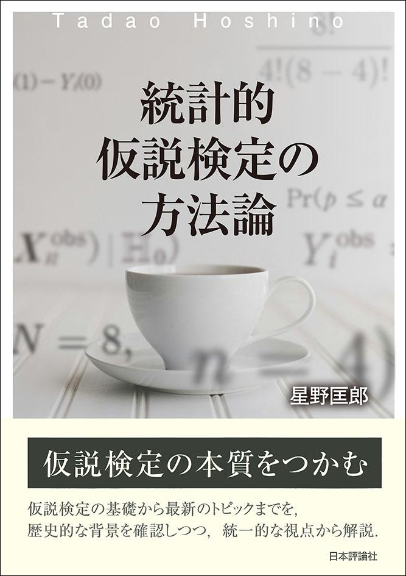
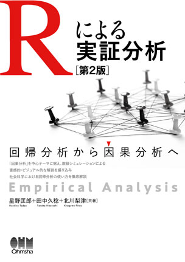

::: {.book-entry}

::: {.book-cover}
{fig-alt="統計的仮説検定の方法論"}
:::

::: {.book-info}
### [統計的仮説検定の方法論](https://www.nippyo.co.jp/shop/book/9561.html){target="_blank"}

- 2025年, 日本評論社
- 星野匡郎 著

:::

:::

::: {.book-entry}

::: {.book-cover}
{fig-alt="Rによる実証分析 第2版"}
:::

::: {.book-info}
### [Rによる実証分析（第2版）：回帰分析から因果分析へ](https://www.ohmsha.co.jp/book/9784274230028.html){target="_blank"}

- 2023年，オーム社
- 星野匡郎，田中久稔，北川梨津 著
- [本書のサポートページ](https://www.rniyoru.com/){target="_blank"}
:::

:::

::: {.book-entry}
::: {.book-info}
### 統計リテラシーβ：データの分布

- 2014年，早稲田大学出版部
- 星野匡郎 著
:::
:::

::: {.book-entry}
::: {.book-info}
### [環境評価の最新テクニック](https://www.keisoshobo.co.jp/book/b26236.html){target="_blank"}

- 2011年，勁草書房
- 柘植隆宏，三谷羊平，栗山浩一 編著
  - 第4章「顕示選好法の新展開」庄子康，星野匡郎，柘植隆宏 著
  - 第6章「顕示選好法の最新テクニック2：空間ヘドニック法」星野匡郎 著

:::
:::